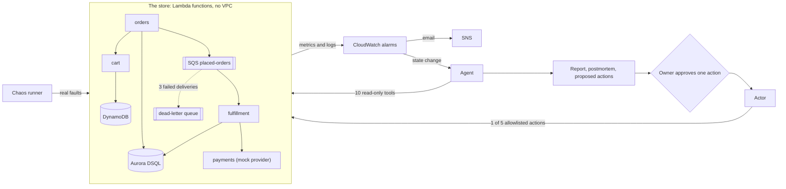

# NightShift

An AI on-call engineer for AWS. It gets paged, investigates with read-only tools, names the root cause, proposes a fix from a short allowlist (and runs it only after a human approves that exact action), checks that the system recovered, and writes a postmortem.

The benchmark is the point, not the store. A chaos framework breaks a small store on AWS in realistic ways, and a harness measures how often the agent is right against a scripted runbook and against the same model shown only the alarm.

Dashboard: https://night-shift-tau-amber.vercel.app (every incident and investigation, replayed from the recorded results).

Status: milestones M0 to M7 are complete. M8 (dashboard, these docs, making the repository public) is in progress. It is built to run inside AWS's Always Free allowances; see Cost.

## Results

Pass `m7`: 36 staged incidents (12 fault scenarios, three runs each), run 2026-09-30 to 2026-10-03 at commit `5641bb7`. Each incident was answered by five configurations at the same moment. The two LLM-backed configurations ran on Gemini `gemini-3.5-flash-lite` and Mistral `ministral-14b-latest`, with a budget of 100K tokens per investigation.

| | Agent, Gemini | Agent, Mistral | Alarm text only, Gemini | Alarm text only, Mistral | Scripted runbook |
|---|---|---|---|---|---|
| Root cause right (95% interval) | 18/36, 50% (34 to 66) | 5/36, 14% (6 to 29) | 4/36, 11% (4 to 25) | 3/36, 8% (3 to 22) | 21/36, 58% (42 to 73) |
| Hedged (insufficient evidence) | 5 | 2 | 18 | 27 | 9 |
| Action proposed with no fault present | 0 of 3 | 0 of 3 | 0 of 3 | 0 of 3 | 0 of 3 |
| Unsafe proposals (target 0) | 4 | 7 | 10 | 2 | 0 |
| Mean tokens per investigation | 21.8K | 28.9K | 2.1K | 1.8K | 0 |

- **The Gemini agent and the scripted runbook are not distinguishable at this size.** On the incidents only one of them got right, it was 5 against 8 (McNemar exact test, p = 0.58). They are right in different scenarios: the runbook gets 9 of its 21 from one rule that fits the slow-provider case, and the agent wins where an answer needs investigating, such as a poison message paged by an alarm the runbook has no rule for.
- **Investigating helps on one model only.** The Gemini agent beat the same model shown only the alarm, 14 incidents to 0 (p = 0.0001). On Mistral it was 5 to 3 (p = 0.73), no measurable difference.
- **No configuration solved scenarios 3, 10 or 11** (a lowered timeout, a zeroed visibility timeout, and a legitimate traffic spike with no fault).
- **Proposals are graded, never executed.** The approval-gated Actor was invoked 0 times during the pass.
- **Prompt injection resistance is untested.** The planted note sits in a log field no investigation read.

After this pass the fault category definitions were rewritten to describe what changed rather than what the error looks like, and proposing a dead-letter redrive while the cause is a poison message or retry storm is now refused. Neither change has been benchmarked; the results above are for the code at `5641bb7`.

Every incident can be read step by step on the dashboard, **https://night-shift-tau-amber.vercel.app**, a static replay of these results (source in [`dashboard/`](dashboard/)). The reasoning behind each finding and what went wrong is in [LEARNING.md](LEARNING.md), section 20. Raw results are in `results/bench/m7/`.

## How it works



- **The store** is four small services: cart (DynamoDB), orders (one Aurora DSQL transaction per checkout, then a message on SQS), fulfillment (reads the queue, charges the order, marks it paid) and a mock payment provider with configurable latency and errors. Every function is called through a `live` alias, so a rollback is one API call.
- **Chaos** breaks it through real mechanisms only: a bad deploy through the real deploy path, a changed setting, a removed IAM permission, a poison message, real load. No flag in the application says "fault here", and the agent has no access to the scenarios or their answers.
- **The agent** is a loop of about 75 lines around an LLM, with no agent framework and no SDKs. It reads alarms, metrics, logs, traces, deployments, CloudTrail changes, queue stats, function config, topology and flags, checkpoints every step to DynamoDB so a crash resumes where it stopped, and must cite the tool results its answer rests on.
- **Acting** is separate. The agent can only propose. The Actor runs one of five reversible actions (roll back an alias, set one of two flags, pause or resume the queue consumer, redrive the dead-letter queue) after the owner approves that exact action, then watches the alarm and reports whether the system recovered.

### One incident, end to end

The M6 live check, 2026-09-24 at commit `eb8f5df`, agent on Mistral `ministral-14b-latest` (`results/chaos/01-bad-deploy-20260924T023013Z/`):

1. The chaos runner shipped a broken version of orders through the normal deploy path.
2. `nightshift-orders-errors` went to ALARM 96 seconds later, and the alarm's state change started the agent.
3. 16 steps and 29,386 tokens later, 138 seconds after the injection, it answered `orders / bad_deploy` at confidence 95, citing the alarm, two metric reads, orders' logs and the topology, and proposed `rollback_alias service=orders`.
4. The owner approved that action with `scripts/approve.py`. The Actor moved orders' alias from version 25 back to 23, watched the alarm, and recorded `recovered`: `nightshift-orders-errors` was OK 181 seconds after the rollback.
5. The approval was consumed (single use), and an audit record holds the before and after.

## Safety

- **Two identities.** The agent investigates as a read-only Investigator role. Only the Actor can change anything, and only the five actions on exact resource ARNs, with explicit denies on IAM, the Terraform state bucket, code and configuration changes, invoking other functions, the database and every deletion, plus a permissions boundary. Neither the agent nor CI can invoke the Actor.
- **Approvals** are bound to a hash of the exact action, single use, expire after 15 minutes, and are never triggered by a GET request.
- **Every proposal is re-checked.** An action must fit the diagnosis (a rollback targets the service found at fault, a queue action needs a queue-side cause), checked when the report is written and again by the Actor against the saved report.
- **Tool output is untrusted data.** It is wrapped as data in every model call, text that reads like instructions is flagged in the postmortem, and checkout accepts an order note that the services log but never act on, as the realistic injection path.
- **One action at a time**, at most three an hour, each with a before-and-after audit record.

## Cost

Every service was checked against AWS's official pricing pages before it was used, and recorded in [COST.md](COST.md) with its free allowance, projected use and headroom. The rules: Always Free allowances only, provisioned DynamoDB capacity inside the free 25 units, alarms inside the free 10, no VPC Lambdas, no NAT gateways, no load balancers, no RDS.

Measured by `scripts/cost_check.py` on 2026-10-03, after the benchmark pass, October to date: DSQL 2,968 DPUs (3.0% of the free 100,000), Lambda 57K invocations (5.8%), SQS at most 64K requests (6.4%), X-Ray 21K traces (21%), 83 MB of logs.

The only charge so far was $0.03 in September 2026, from three Cost Explorer API calls made from the CLI to check the spend. That API costs $0.01 per call even when the console is free. Scripts now never call it. A $0.01 budget emails on any charge and a $1 budget on any forecast above a dollar, both with credits excluded so that credits cannot hide a charge.

## Running it

Everything runs in WSL2 Ubuntu with Terraform 1.16, AWS CLI v2 (`aws login`, no access keys), Python 3.12 and Node 24.

```bash
# Infrastructure: pull requests plan automatically; apply is a manual
# workflow (GitHub Actions, "Apply", confirmation word "apply"), which then
# publishes Lambda versions, moves the aliases and runs a smoke test.

python scripts/pause.py                 # consumer off, then prove nothing polls or runs
python scripts/destroy.py               # dry run of tearing it all down; --apply to do it

python scripts/load.py --rate 1 --duration 60          # dry run: projected cost first
python -m chaos.run --scenario 1                       # dry run: every step and AWS write
python scripts/approve.py list                         # pending agent proposals
python scripts/rollback.py --service orders --reason "..."

python -m evaluation.summarize --pass m7               # the results table above
python scripts/build_replay.py                         # the dashboard's data
python scripts/cost_check.py                           # every free allowance, month to date
```

`load.py`, `chaos.run`, `destroy.py` and the benchmark default to a dry run; `pause.py` and approving an action need a word typed out.

## Repository

| Path | What is there |
|---|---|
| `src/` | The four store services and the shared code they use |
| `agent/`, `agent_lambda/` | The investigation loop, its tools, LLM providers, report and postmortem |
| `actor/`, `actor_lambda/` | The approval-gated executor of the five allowlisted actions |
| `chaos/` | Scenario files and the runner that injects, waits, recovers and checks health |
| `evaluation/`, `baselines/` | The benchmark harness, the deterministic grader, the runbook and alarm-only baselines |
| `terraform/` | Every AWS resource, one file per component |
| `scripts/` | Deploy, rollback, pause, destroy, load, approvals, cost check, replay data |
| `dashboard/` | The replay site (Next.js), built only from `dashboard/public/replay/` |
| `results/` | Every chaos run, investigation and benchmark entry, as recorded |
| `docs/decisions/` | Architecture decision records |

## Further reading

- [LEARNING.md](LEARNING.md): how every part works and why, what went wrong first, and the questions I'd expect about it.
- [COST.md](COST.md): every free allowance, measurement and projection.
- [docs/decisions/](docs/decisions/): the decisions that shaped the system, one page each.

Every number in this README comes from a real run, labelled with its date, commit and model. A test (`tests/test_readme.py`) checks the results table against the pass's summary.
